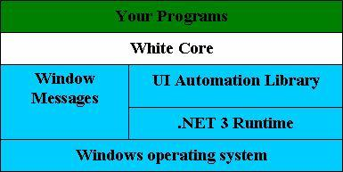
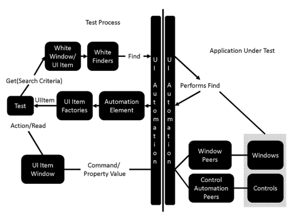

White is a framework for automating rich client applications based on Win32, WinForms, WPF, Silverlight and SWT (Java) platforms.  It is .NET based and does not require the use of any proprietary scripting languages.  Tests/automation programs using White can be written with whatever .NET language, IDE and tools you are already using. White provides a consistent object-oriented API, hiding the complexity of Microsoft's UIAutomation library (on which White is based) and windows messages. 

##How white works?

At runtime white programs stack would look like this.

White programs **must** run in a different process from the AUT (Application Under Test) process.

## Essential Tools
[https://uiautomationverify.codeplex.com/](https://uiautomationverify.codeplex.com/) is an essential tool when working with White, it can give you a lot of information about the application you are trying to automate

## Is White the right choice?
White is a library which expects it's consumers to have development skills. A recorder is no longer provided, so it is recommended testers with no development experience work with developers to use White, or look for another tool which is geared more towards testers directly.

### Third Party Controls
White works on top of UIAutomation framework of .Net. If you intend to or have third party controls in your application, you should verify whether they these controls are supported by UIA. You can use UIAutomationVerify http://www.codeplex.com/UIAutomationVerify to check this. When any controls is supported the tool would show you the inner details of the control in a tree form.

### Would white support my application and controls inside it? (.....as I am not using standard .NET application)
White does support Win32, WPF, WinForm, SWT and Silverlight applications. In fact SWT is a type of Win32 application when running on windows. Powerbuilder, MFC, etc applications are all Win32 applications as well. In order to determine which controls are automatable, please use UISpy or UIAutomationVerify to check whether these controls are visible using MS UIAutomation. White is based on UIAutomation framework.

## Getting hold of a window
    Application application = Application.Launch("foo.exe");
    Window window = application.GetWindow("bar", InitializeOption.NoCache);

White uses the UI Automation API (UIA) to find controls on a window. UIA communicates to a displayed window via window messages. This find is performed by iterating through all the controls in a window. This can be slow for windows which have a lot of UIItems. White supports position-based caching of UIItem find results to improve performance. Speed up performance by Position based search

WithCache creates a cache of PrimaryUIItems. This cache is not meant to be used directly by automation programs.
See Working with window for more.

## Finding a UI Item and performing action
    Button button = window.Get<Button>("save");
    button.Click();

## Finding a UIItem based on SearchCriteria
    SearchCriteria searchCriteria =     SearchCriteria.ByAutomationId("name").AndControlType(typeof(TextBox)).AndIndex(2);
    TextBox textBox = (TextBox) window.Get(searchCriteria);
    textBox.Text = "Anil";
    
UIItems can be searched based on a lot of parameters. For more look here: UIItem Identification

## Architecture

## Silverlight Support
You would need to add reference to white.webbrowser.dll along with TestStack.White.dll.

	InternetExplorerWindow  browserWindow = InternetExplorer.Launch("http://localhost/white.testsilverlight/TestSilverlightApplicationTestPage.aspx", "FooApp Title - Windows Internet Explorer");
	SilverlightDocument document = browserWindow.SilverlightDocument;
	Button button = document.Get<Button>("buton");
	Label label = document.Get<Label>("status");

//...so on. The objects Button, Label etc behave the same way as for WinForm/WPF etc.
Please look at the rest of the documentation to understand other aspects of white. This shows what you need to do extra to use Silverlight.

**NOTE:** Silverlight support is not tested, and likely has many issues. I am considering dropping Silverlight support unless **members of the Community improve test coverage** of the Silverlight support in White  
   
 I recommend checking out Coded UI for Silverlight [http://timheuer.com/blog/archive/2010/11/24/coded-ui-available-for-silverlight-4.aspx](http://timheuer.com/blog/archive/2010/11/24/coded-ui-available-for-silverlight-4.aspx)